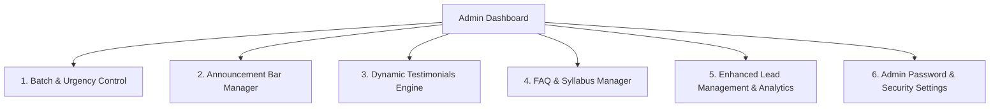

# Admin Panel Enhancement & Customization Plan

This document presents a comprehensive set of proposed customization features and modules to upgrade the **LearnSetu Real-Time Admin Dashboard**. These enhancements will give full administrative control over website content, enrollment urgency banners, dynamic testimonials, FAQs, and lead analytics without writing any code.

---

## 🛠️ Proposed Admin Panel Modules

---

### Module 1: Batch & Urgency Countdown Manager ⏳
**Goal:** Control enrollment scarcity and urgency triggers live across the website.

- **Configurable Fields:**
  - **Batch Name & Code**: e.g., `BATCH #2026-A` or `BATCH #2026-B`
  - **Batch Start Date**: e.g., `July 28, 2026` or `August 15, 2026`
  - **Seats Remaining**: e.g., `Only 4 seats left` (live badge on Hero & Course cards)
  - **Countdown Timer Target**: Dynamic ISO date for live countdown clock on Hero & Pricing sections.
  - **Batch Status Toggle**: `Enrolling Open` | `Almost Full` | `Batch Closed (Waitlist)`

---

### Module 2: Top Announcement Banner Customizer 📢
**Goal:** Run promotional offers, early-bird discounts, and flash announcements across the top of the entire website.

- **Configurable Fields:**
  - **Banner Active Toggle**: Enable / Disable banner sitewide
  - **Banner Message**: e.g., `"⚡ Early Bird Discount: Flat ₹2,000 Off on Batch #2026-A! Use code LEARNSETU2000"`
  - **CTA Button Text & Link**: e.g., `"Claim Offer"` → scrolls to `#master-course` or opens WhatsApp chat
  - **Banner Style Theme**: `Electric Blue` | `Emerald Green` | `Flame Orange` | `Purple Violet`

---

### Module 3: Dynamic Testimonials & Success Stories Engine ⭐
**Goal:** Add, edit, feature, or remove student placement success stories dynamically.

- **Features:**
  - **Add New Testimonial**: Student Name, Prior Role, Placed Role & Company, Salary Hike %, Testimonial Text, Profile Photo URL / Upload.
  - **Feature / Hide Controls**: Toggle which testimonials appear on the home page.
  - **Order Priority**: Drag-and-drop or numerical sorting for top student stories.

---

### Module 4: Live FAQ & Content Manager ❓
**Goal:** Easily add new student questions or update curriculum module highlights.

- **Features:**
  - **FAQ Management**: Add new Q&A items, edit existing questions, or reorder FAQ accordion items.
  - **Brochure Link Configurator**: Update the PDF brochure download URL anytime a new version is uploaded.

---

### Module 5: Enhanced Lead Analytics & WhatsApp CRM Integration 📊
**Goal:** Turn the Admin Panel into a quick conversion hub for lead management.

- **Features:**
  - **Lead Analytics Cards**: Total leads today, this week, and month-to-date conversion metrics.
  - **One-Click WhatsApp Chat Button**: Next to each lead in the Admin table, a single click launches WhatsApp web pre-filled with:
    `"Hi [First Name], thanks for downloading the LearnSetu Data Science brochure! Do you have any questions about Batch #2026-A?"`
  - **Lead Status Tags**: Track progress per lead (`New` | `Contacted` | `Enrolled` | `Follow Up`).

---

### Module 6: Admin Password & Security Settings 🔒
**Goal:** Allow changing admin passkeys and managing login credentials securely.

- **Features:**
  - **Update Password Form**: Change master key from admin UI.
  - **Session Expiry Config**: Auto logout after inactivity.

---

## 📋 Open Questions & Feedback Needed

> [!IMPORTANT]
> Please review the proposed modules above and select which ones you would like us to build first:
>
> 1. **Option A (Recommended Full Upgrade):** Build all 6 modules (Urgency Manager, Announcement Bar, Testimonials Manager, FAQ Editor, WhatsApp Lead CRM, & Security).
> 2. **Option B (Urgency & Leads focus):** Focus on Module 1 (Batch Urgency), Module 2 (Announcement Bar), and Module 5 (WhatsApp Lead CRM).
> 3. **Option C (Custom Selection):** Specify any specific modules from above that you want implemented.

---

## ⚡ Proposed File Changes

### Component / Schema Updates

#### [MODIFY] [SettingsContext.tsx](file:///c:/Users/Mandar/OneDrive/Desktop/STITCH%20X%20LEARNSETU/src/context/SettingsContext.tsx)
Expand `SiteSettings` state interface to store batch start date, seats remaining, announcement bar text/active status, and FAQs.

#### [MODIFY] [AdminDashboard.tsx](file:///c:/Users/Mandar/OneDrive/Desktop/STITCH%20X%20LEARNSETU/src/admin/AdminDashboard.tsx)
Add new navigation tabs (`Batch & Urgency`, `Announcements`, `Testimonials`, `FAQs`, `Analytics`).

#### [MODIFY] [Hero.tsx](file:///c:/Users/Mandar/OneDrive/Desktop/STITCH%20X%20LEARNSETU/src/components/Hero.tsx)
Connect dynamic batch start date, seats remaining counter, and announcement banner.

#### [MODIFY] [CourseShowcase.tsx](file:///c:/Users/Mandar/OneDrive/Desktop/STITCH%20X%20LEARNSETU/src/components/CourseShowcase.tsx)
Connect dynamic batch name and seats remaining badge.

#### [MODIFY] [Navbar.tsx](file:///c:/Users/Mandar/OneDrive/Desktop/STITCH%20X%20LEARNSETU/src/components/Navbar.tsx)
Render top announcement banner dynamically when active.

---

## 🧪 Verification & Testing Plan

### Automated Verification
- Run `npm run build` to ensure all TypeScript interfaces and Supabase state updates compile without errors.

### Manual Verification
- Log into Admin Panel at `/admin` (or via hidden footer key combo).
- Update batch start date, seats remaining, and promo announcement bar.
- Save changes and verify live reactive updates on the homepage in real-time.
